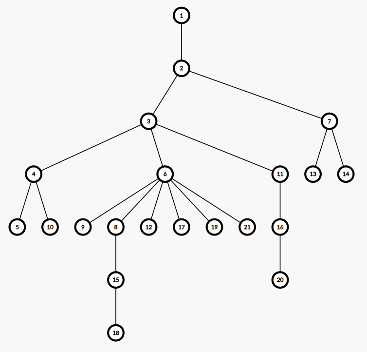
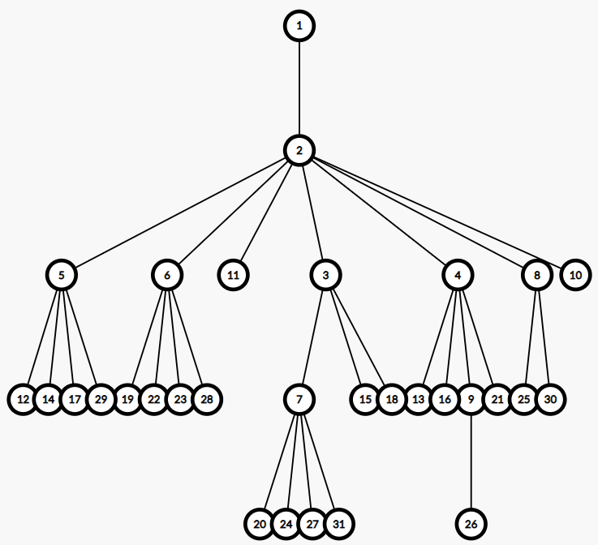
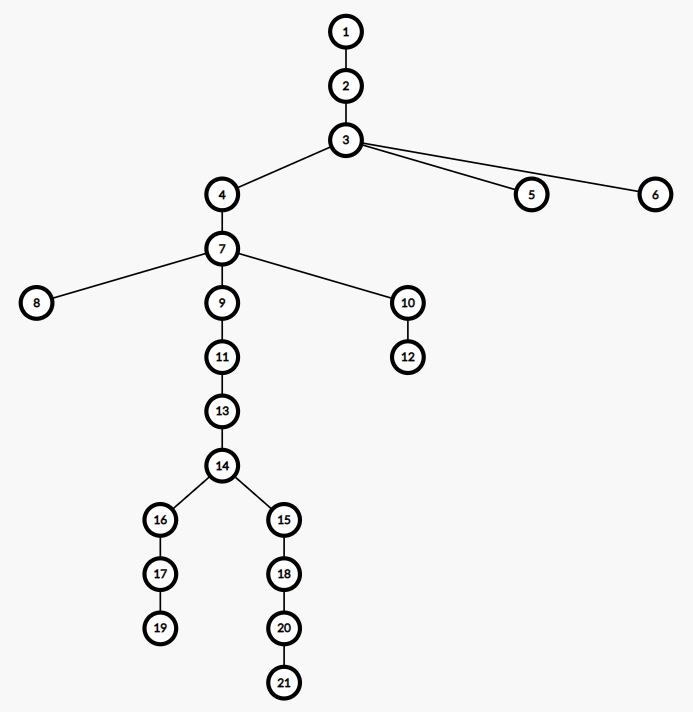
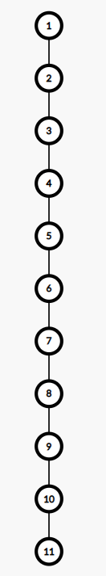
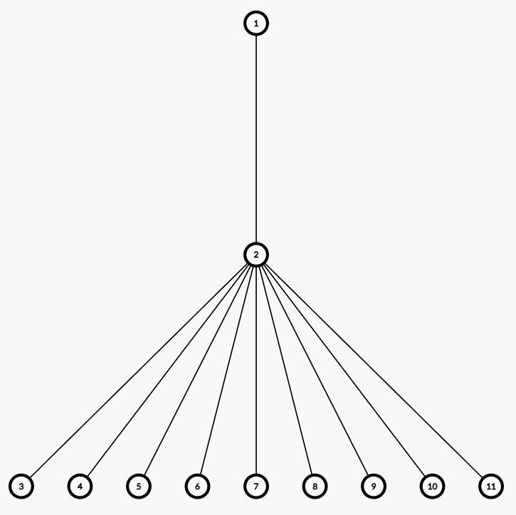
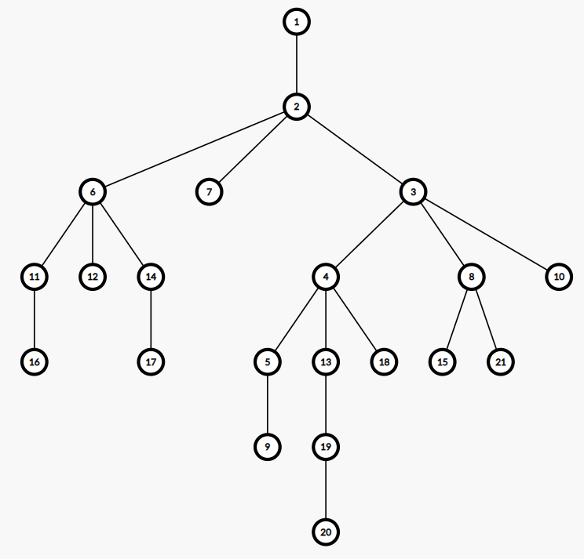
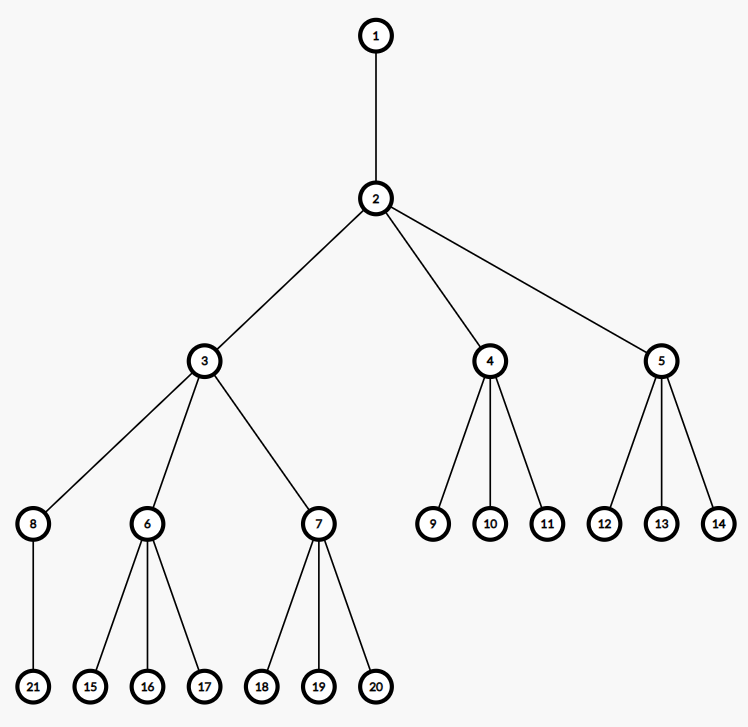
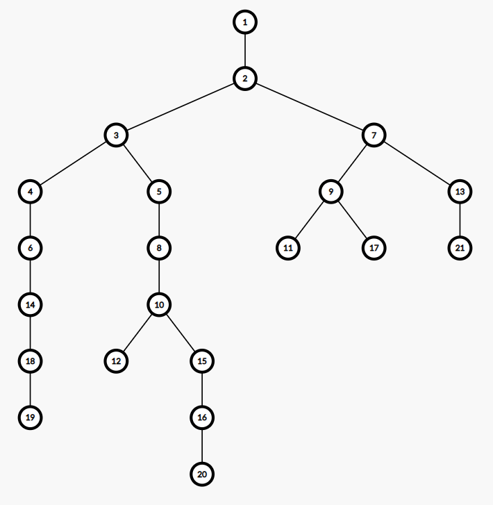
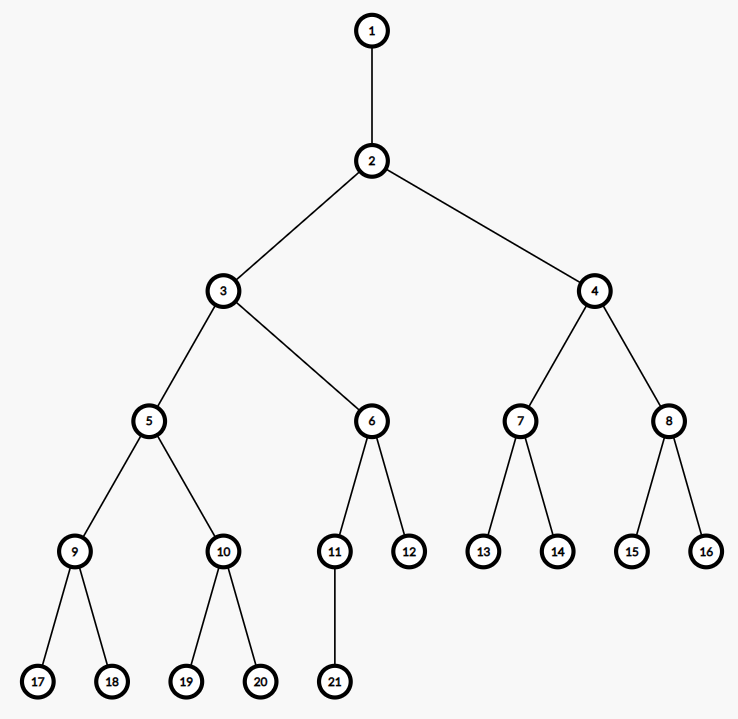
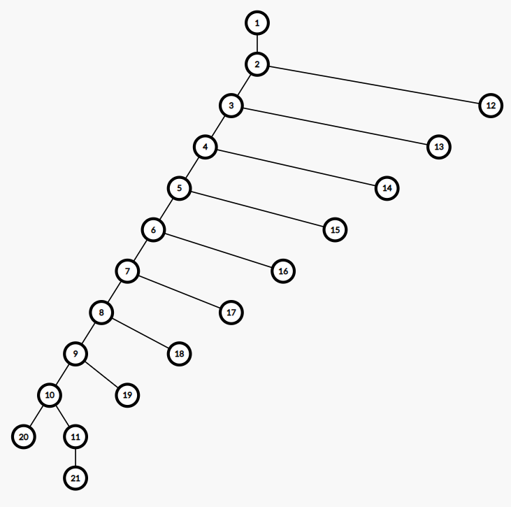

## Header file and namespace

```cpp
#include "treegenerator.h"
```

Please put the file `treegenerator.h` in the same folder as your .cpp source file, or use the compile option `-I <header_file_path>`.

```cpp
using namespace tree_generator_by_ouuan;
```

Of course, you can also use `tree_generator_by_ouuan::` when necessary.

## Declare a tree

```cpp
Tree t; // a tree with a single node
Tree t(10); // a random tree with 10 nodes
Tree t("ch9,0"); // a tree with 10 nodes in the shape of a chain, see "Generate trees by strings" for more details
```

## Nodes

The nodes are 0-indexed. (However, the default output function is 1-indexed.)

You can't declare an empty tree, and the initial single node is numbered 0.

When adding a new node, it will be numbered n, where n is the size of the tree before adding this node.

In the following functions, the nodes are added in some BFS order (so are the numbers of the nodes), you can see the codes for the details.

`void addNode(int pa)`: add a node whose parent is `pa`.

`void random(int n, int pa)`: add a random tree consisting of n nodes whose root's parent is `pa`.



`void lowhigh(int n, double low, double high, int pa)`: add a random tree consisting of n nodes whose parent is `pa`, the parent of the i-th node is chosen from the interval [(i-1)\*low, (i-1)\*high].



`void tall(int n, int k, int pa)`: add a tree consisting of n nodes whose root's parent is `pa`, in which the parent of the node i is random but has no more than k choice. Specifically, only the last k nodes created before i can be the parent of i, except the first k nodes.



`void chain(int n, int pa)`: the same as `tall(n, 1, pa)`.



`void star(int n, int pa)`: add a tree consisting of n nodes whose root's parent is `pa`, and except the root, all nodes' parent is the root.

`void flower(int n, int pa)`: the same as `star(n, pa)`. This function exists because many Chinese call this kind of tree "chrysanthemum tree".



`void maxDegree(int n, int k, int pa)`: add a random tree consisting of n nodes whose root's parent is `pa`, and all nodes' degrees don't exceed k.

`void lowhighMaxDegree(int n, int k, double low, double high, int pa)`: lowhigh + maxDegree.



`void complete(int n, int k, int pa)`: add a complete tree (like complete binary tree) consisting of n nodes whose root's parent of `pa`, and all nodes' degrees don't exceed k.



`void binary(int n, int pa)`: the same as `maxDegree(n, 3, pa)`.



`void completeBinary(int n, int pa)`: the same as `complete(n, 3, pa)`.



`void silkworm(int n, int pa)`: add a tree consisting of n nodes whose root's parent is `pa`, and it's based on a chain with one extra son for each node.



`void addLeaves(int n, int l, int r)`: add n nodes, whose parents' numbers are in the range [l, r].

## Shuffle

You can use `shuffleNodes()` to shuffle the nodes, but it only affects the output, the inner number of each node will not change. The function has a parameter `from`, you can use `shuffleNodes(int from)` to shuffle the nodes, then the first `from` nodes (nodes 0 ~ from - 1) will keep unchanged.

You can use `shuffleEdges()` to reorder the edges. It only affects the output, too.

## Generate trees by strings

Example:  `Tree("bi30,0sw20,30fl10,50ch20,0al5,61,80")`

`void addNode(int pa)`: `nd<pa>`

`void random(int n, int pa)`: `rd<n>,<pa>`

`void lowhigh(int n, double low, double high, int pa)`: `lh<n>,<low>,<high>,<pa>`

`void tall(int n, int k, int pa)`: `tl<n>,<k>,<pa>`

`void chain(int n, int pa)`: `ch<n>,<pa>`

`void star(int n, int pa)`: `st<n>,<pa>`

`void flower(int n, int pa)`: `fl<n>,<pa>`

`void maxDegree(int n, int k, int pa)`: `md<n>,<k>,<pa>`

`void lowhighMaxDegree(int n, int k, double low, double high, int pa)`: `lm<n>,<k>,<low>,<high>,<pa>`

`void complete(int n, int k, int pa)`: `cp<n>,<k>,<pa>`

`void binary(int n, int pa)`: `bi<n>,<pa>`

`void completeBinary(int n, int pa)`: `cb<n>,<pa>`

`void silkworm(int n, int pa)`: `sw<n>,<pa>`

`void addLeaves(int n, int l, int r)`: `al<n>,<l>,<r>`

## Customize random function and output function

Example:

```cpp
void myOutputEdge(ostream& os, int u, int pa)
{
    os << u + 1 << ' ' << pa + 1 << ' ' << randint(1, 10) << endl;
}

outputEdge = myOutputEdge;
```

```cpp
#include "testlib.h"

int myRandInt(int l, int r)
{
    return rnd.next(l, r);
}

randint = myRandInt;
```

## Other functions

`int size()`: return the number of nodes.

`void resize(int n)`: add leaves if n > size, cut the last size - n nodes and reorder the nodes and edges if n < size.

`void printEdge(int edgeID, ostream& os = cout)`: print an edge.

`int parent(int u)`: return the parent of node u.