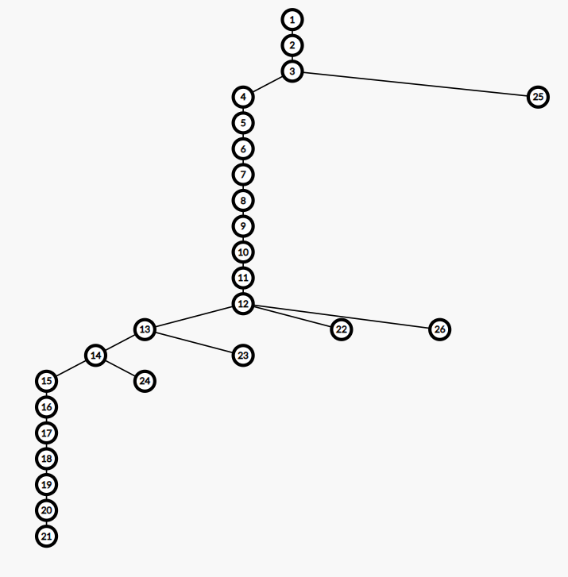
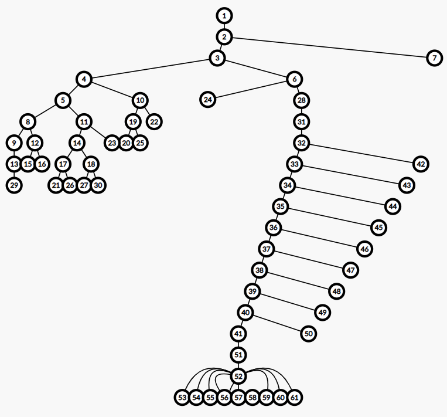
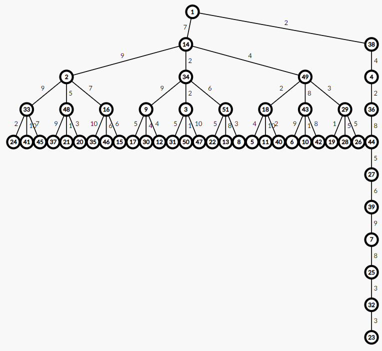

## Tree-Generator
Help problem setters to generate a variety of trees.

You can generate different trees with few functions or even a string, and customize the output function or the random function.

It **hasn't** been well-tested yet, so bug reports are welcomed.

### How to use?

Please read the [GUIDEBOOK](/GUIDEBOOK.md).

### Demo

```cpp
#include "treegenerator.h"

using namespace std;
using namespace tree_generator_by_ouuan;

void myOutputEdge(ostream& os, int u, int pa)
{
    os << u + 1 << ' ' << pa + 1 << ' ' << randint(1, 10) << endl;
}

int main()
{
    cout << Tree("ch20,0al5,1,20") << endl;
    cout << Tree("bi30,0sw20,30fl10,50") << endl;

    Tree t;
    t.complete(40, 4, 0);
    t.chain(10, 0);
    t.shuffleNodes(1);
    t.shuffleEdges();
    outputEdge = myOutputEdge;
    cout << t << endl;

    return 0;
}
```







(visualization by [CS Academy](https://csacademy.com/app/graph_editor/))